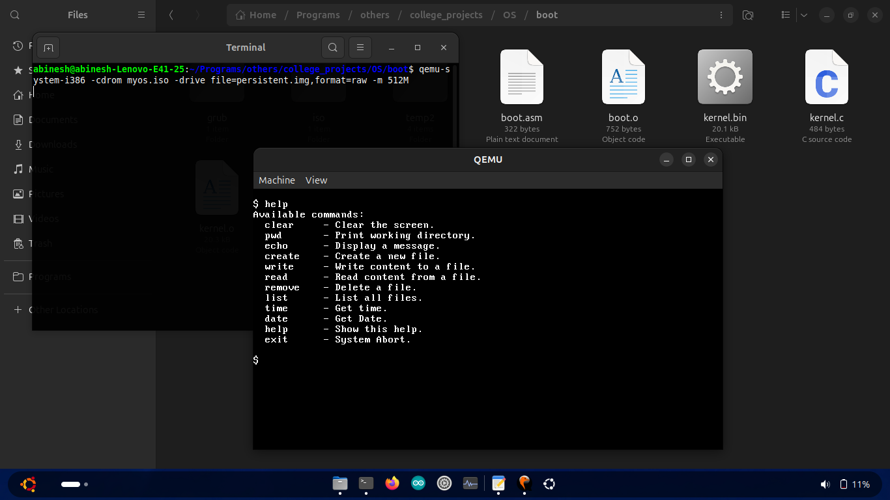

---

# Shadow OS

**Shadow OS** is a minimal experimental operating system written in **C programming language** and **x86 Assembly**.
It demonstrates how a simple operating system boots, loads a kernel, and provides a basic command-line interface.

The project is designed for **learning operating system internals**, including bootloaders, kernel compilation, disk images, and virtualization.

The OS can run inside the **QEMU** emulator or **Oracle VM VirtualBox**.

---

# Project Overview

Shadow OS implements the fundamental parts of an operating system:

• Bootloader initialization
• Kernel loading
• Command-line interface
• File operations simulation
• Basic system commands

The system boots from a **GRUB-based ISO image** and runs inside an emulator.

---

# Screenshot

Example of Shadow OS running inside **QEMU**



The OS provides a terminal-like interface with commands such as:

```
clear
pwd
echo
create
write
read
remove
list
time
date
help
exit
```

---

# Features

### Bootable Operating System

The OS boots from a **bootable ISO image**.

### Command Line Interface

Users interact with the system through commands.

### File System Simulation

The OS simulates file creation, reading, writing, and deletion.

### Kernel Execution

The kernel handles command execution and system behavior.

### Virtualization Support

Shadow OS can run inside:

• QEMU
• VirtualBox

---

# Project Architecture

The system architecture consists of the following layers:

```
Hardware / Emulator
        ↓
Bootloader (Assembly)
        ↓
Kernel (C)
        ↓
Command Interpreter
        ↓
User Commands
```

---

# Directory Structure

```
ShadowOS
│
├── boot.asm        # Bootloader code (Assembly)
├── kernel.c        # Kernel implementation
├── linker.ld       # Kernel linker script
├── boot.o          # Bootloader object file
├── kernel.o        # Kernel object file
├── kernel.bin      # Final kernel binary
├── iso/            # Bootable ISO structure
│   └── boot/
│       └── grub/
│           └── grub.cfg
└── myos.iso        # Bootable ISO image
```

---

# Command System

Shadow OS provides several built-in commands.

| Command | Description               |
| ------- | ------------------------- |
| clear   | Clears the screen         |
| pwd     | Prints working directory  |
| echo    | Displays a message        |
| create  | Creates a new file        |
| write   | Writes content to a file  |
| read    | Reads content from a file |
| remove  | Deletes a file            |
| list    | Lists files               |
| time    | Shows current time        |
| date    | Shows system date         |
| help    | Displays command list     |
| exit    | Aborts the system         |

---

# Example Usage

### Display help

```
$ help
```

Output:

```
Available commands:
clear   - Clear the screen
pwd     - Print working directory
echo    - Display a message
create  - Create a new file
write   - Write content to a file
read    - Read content from a file
remove  - Delete a file
list    - List all files
time    - Get time
date    - Get date
help    - Show this help
exit    - System Abort
```

---

# Development Environment

Shadow OS is developed on **Ubuntu** using common low-level programming tools.

Required tools include:

• NASM assembler
• GCC cross compiler
• GRUB bootloader tools
• QEMU emulator

---

# Installing Required Tools

Install the required packages:

```bash
sudo apt install build-essential nasm xorriso grub-pc-bin
sudo apt install qemu-kvm -y
sudo apt install gcc-i686-linux-gnu binutils-i686-linux-gnu
sudo apt install grub-pc-bin xorriso
sudo apt install mtools
```

Verify the cross compiler:

```bash
i686-linux-gnu-gcc --version
i686-linux-gnu-ld --version
```

---

# Create Workspace

```
mkdir -p myos/{boot,iso}
cd myos
```

---

# Assemble Bootloader

Compile the assembly bootloader.

```
nasm -f elf32 boot.asm -o boot.o
```

---

# Compile Kernel

Compile the kernel using the cross compiler.

```
i686-linux-gnu-gcc -ffreestanding -m32 -c kernel.c -o kernel.o
```

Explanation:

• `-ffreestanding` – compile without standard libraries
• `-m32` – target 32-bit architecture

---

# Link the Kernel

Link bootloader and kernel together.

```
i686-linux-gnu-ld -T linker.ld -o kernel.bin kernel.o boot.o
```

---

# Create Bootable ISO

Create the directory structure:

```
mkdir -p iso/boot/grub
```

Copy kernel:

```
cp kernel.bin iso/boot/kernel.bin
```

Create GRUB configuration:

```
nano iso/boot/grub/grub.cfg
```

Add:

```
set timeout=0
set default=0

menuentry "MyOS" {
    multiboot /boot/kernel.bin
    boot
}
```

Create ISO:

```
grub-mkrescue -o myos.iso iso
```

---

# Create Persistent Disk Image

Create a virtual disk for storage.

```
qemu-img create -f raw persistent.img 50M
```

---

# Run in QEMU

Run the OS using **QEMU**.

```
qemu-system-i386 -cdrom myos.iso -drive file=persistent.img,format=raw -m 512M
```

---

# Running in VirtualBox

You can also boot Shadow OS using **Oracle VM VirtualBox**.

### Step 1 Create VM

Name: MyOS
Type: Other
Version: Other/Unknown

### Step 2 Configure Hardware

Memory: 128MB minimum

Hard Disk: Do not add disk

---

### Step 3 Attach ISO

Settings → Storage → IDE Controller

Attach:

```
myos.iso
```

---

### Step 4 Boot

Start the virtual machine.

If everything is correct, Shadow OS will boot.

---

# VirtualBox Storage Controllers

| Use Case               | Recommended Controller |
| ---------------------- | ---------------------- |
| Booting ISO            | IDE                    |
| Modern OS installation | SATA                   |
| High performance disks | NVMe                   |

---

# Educational Concepts

This project demonstrates several operating system concepts:

• Bootloaders
• Kernel development
• Cross compilation
• Assembly programming
• GRUB boot process
• OS virtualization

It is a great starting point for learning **operating system development**.

---

# Future Improvements

Possible future improvements:

• Real file system support
• Keyboard drivers
• Memory management
• Process scheduling
• Interrupt handling
• Graphical interface
• Multitasking

---

# Author

Abinesh N

GitHub
[https://github.com/Abineshabee](https://github.com/Abineshabee)

---

